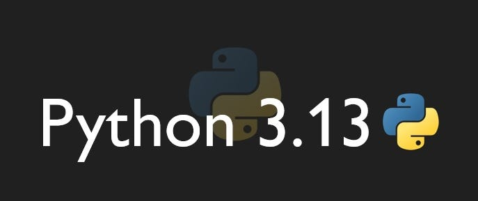

## Predator Prey Simulation using Python 

Created in Python 3.13 with Numba and WASM for optimization.

Do not use other versions of Python, if you do, I am not responsible for any errors that may occur.

Agents: Sheep, Wolves, and Grass.

Public DEMO: https://predatorpreys.com

The Demo is hosted on Cloudflare, if you reside in Spain take into account that 
there's a law allowing LaLiga to block Cloudflare during football matches,
if you can't access the website, probably there's a football match going on, 
wait for it to end and try again.

### Installation

1. Install Python 3.13
2. Install the required libraries: `pip install -r requirements.txt`
3. Run the simulation: `python model.py`

(Optional 4.) To run the web version, launch the command which uses main.py:
`python -m pygbag --PYBUILD 3.13 --template xtemplate.tmpl --disable-sound-format-error --build .`

Optimized both for: 
- Local By Numba
- Web By WASM
